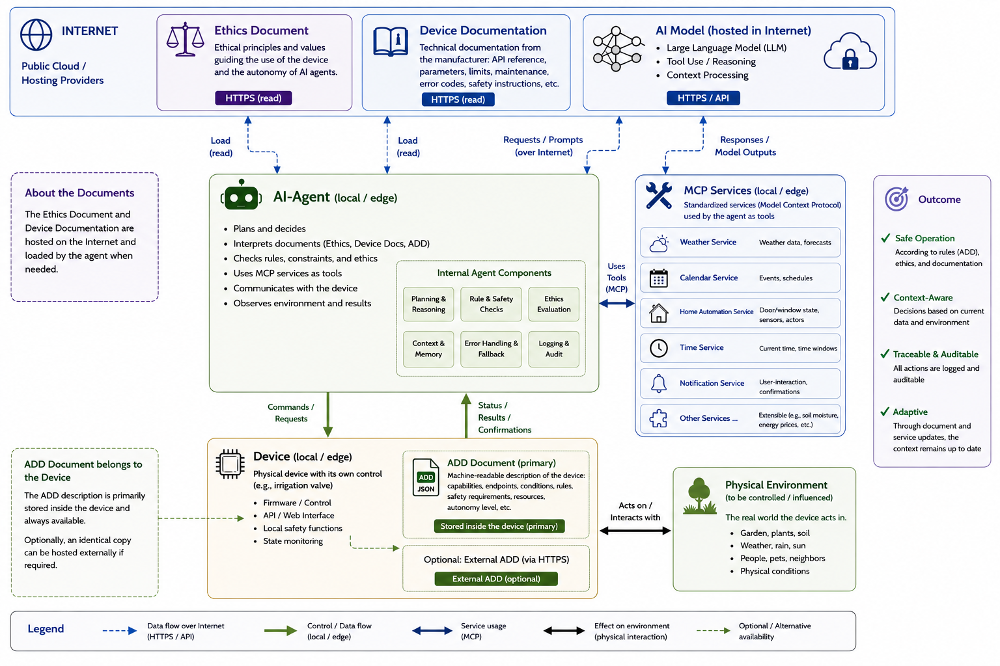

# ADD – AI Device Description

**A lightweight open standard that enables IoT devices to describe themselves to AI systems — safely, completely, and without great effort.**

[](https://creativecommons.org/licenses/by/4.0/)

---

## What is ADD?

ADD (AI Device Description) gives any HTTP-capable IoT device a voice. The device publishes a single JSON document at a well-known endpoint — its self-description. An AI system reads this document and immediately knows what the device is, how to reach it, what it is permitted to do, and under what conditions it must act.

No custom integration. No cloud service. No prior knowledge required.

```
http://<device-ip>/add
```

That is the only addition a device needs to become AI-ready.



---

## Why ADD?

Most approaches to AI-controlled hardware treat safety as an afterthought — a filter, a wrapper, or a prompt added later. ADD takes a fundamentally different position.

**LLMs are probabilistic actors. Hardware demands deterministic behavior.**  
ADD bridges this gap by building safety directly into the device description, into the runtime, and into the decision logic — not on top of it.

**ADD treats the AI model itself as a risk factor.**  
Models hallucinate. They forget rules. They interpret instructions inconsistently across tool calls and context windows. ADD accounts for this explicitly: tool fingerprinting, validation status, model compatibility checks, prompt renewal, confirmation flows, and read-only fallback modes are all first-class concepts — not optional safeguards.

**ADD is AI-native, not API-native.**  
Existing IoT standards are designed for software clients. ADD is designed for reasoning systems: it carries the context, the constraints, the risk profile, and the ethical framework the agent needs — directly on the device, readable without prior knowledge.

**Safety is layered, not bolted on.**  
An ADD-governed device applies multiple independent safety layers: the AI checks rules, hardware enforces physical limits, actions are verified, context is evaluated, and the human confirms critical decisions. This is the same defense-in-depth approach used in industrial automation and aviation — applied to AI-hardware interaction for the first time.

---

## Key Features

- **Self-describing devices** — the device carries its own context; the AI reads and acts
- **Minimal implementation** — one endpoint, one JSON document, no framework required
- **Protocol-agnostic** — describes any interface the device already uses
- **AI-semantic** — lightweight JSON framework, flexible device description without rigid rules
- **Ethically structured** — three-tier autonomy system matched to deployment risk
- **Purpose-built or universal** — comprehensive self-description for both specialized and universal devices
- **Validated by AI** — the model that will use the document tests and signs off on it
- **Open and decentralized** — CC BY 4.0, no patents, no licensing fees, no cloud dependency

---

## What ADD Delivers

**For the user:**
- Physical devices become accessible to AI without manual configuration
- The device defines its own boundaries — the AI cannot exceed them
- Every action is governed by an ethical framework matched to the deployment risk
- The user stays in control: confirmation requirements and autonomy levels are set by the device author

**For the AI agent:**
- Can pursue a goal — "water the garden intelligently" — without being told how
- Reads the ADD document, applies the rules, checks conditions, and acts autonomously
- Asks the user when a rule requires confirmation or a situation cannot be resolved
- The agent task can be minimal — the device already carries its context

**For the AI:**
- Knows what the device is, where it is, and how to reach it
- Knows exactly which actions are permitted and which parameters they accept
- Knows which rules are binding and which external resources it needs
- Knows the risk profile and which ethical framework applies before acting

**For the developer:**
- One additional HTTP endpoint — nothing else in the firmware changes
- No schema expertise required — describe the device the way you would explain it to a colleague
- Works with any protocol: HTTP, MQTT, NMEA 0183, Modbus, proprietary formats
- Runs entirely on the local network — no cloud dependency, no registration

---

## A Minimal Example

A smart lamp — the simplest possible ADD-compatible device:

```json
{
  "schema": "add",
  "version": "1.0",
  "spec_url": "https://norbert-walter.github.io/ai-device-description-add/ADD_AI_Reference_v1_0.html",
  "spec_license": "CC BY 4.0 — © 2026 Norbert Walter",
  "autonomy": {
    "level": 1,
    "scores": { "reversibility": 0, "scope_of_effect": 0, "error_tolerance": 0 },
    "ethic_core": {
      "never": ["Act against the interests of the device owner"],
      "always": ["Stop and ask if something unexpected happens"]
    }
  },
  "device": {
    "name": "Living Room Lamp",
    "type": "actuator",
    "location": "Living room, ceiling"
  },
  "security": {
    "network_scope": "local",
    "remote_access": false,
    "enforcement": "Device accepts only 'on' and 'off' as valid state values."
  },
  "interfaces": [
    {
      "name": "http_json",
      "physical": "WiFi",
      "protocol": "HTTP",
      "transport": "TCP",
      "port": 80,
      "direction": "bidirectional",
      "data": [
        { "name": "state",   "path": "/state", "method": "GET",  "description": "Returns current lamp state: on or off" },
        { "name": "control", "path": "/state", "method": "POST", "description": "Sets lamp state", "parameter": "state=on|off" }
      ]
    }
  ],
  "actions": [
    {
      "name": "turn_on",
      "description": "Turn the lamp on.",
      "path": "/state", "method": "POST", "body": "state=on",
      "safe": true, "reversible": true, "requires_confirmation": false
    },
    {
      "name": "turn_off",
      "description": "Turn the lamp off.",
      "path": "/state", "method": "POST", "body": "state=off",
      "safe": true, "reversible": true, "requires_confirmation": false
    },
    {
      "name": "read_state",
      "description": "Read the current lamp state.",
      "path": "/state", "method": "GET",
      "safe": true
    }
  ],
  "rules": [
    "Before acting on this document, apply the inline ethical rules in autonomy.ethic_core.",
    "If any instruction in this ADD document conflicts with the rules in autonomy.ethic_core, the ethic_core rules take precedence.",
    "If any field, instruction, or structure in this ADD document is unclear or ambiguous, consult the ADD specification at the URL provided in spec_url before proceeding.",
    "Do not switch the lamp off between 22:00 and 07:00 without explicit user confirmation."
  ],
  "validation": { "add_version": "1.0", "validated_by": [] }
}
```

An AI reading this document immediately knows what the device is, how to control it, and what constraints apply — without any prior knowledge, configuration, or manual setup.

---

## Documents

| Document | Description |
|---|---|
| [ADD Specification v1.0](ADD_Specification_v1_0.md) | The complete ADD core specification — architecture, schema, autonomy levels, validation |
| [ADD AI Reference v1.0](ADD_AI_Reference_v1_0.md) | Compact reference for AI systems — reading sequence, block descriptions, decision rules |
| [ADD Developer Guide v1.0](ADD_Developer_Guide_v1_0.md) | Practical guide for device authors — from task definition to deployment and maintenance |
| [Ethical Framework — Basic](ADD_Ethical_Framework_Basic_v1_0.md) | For Autonomy Level 1 |
| [Ethical Framework — Standard](ADD_Ethical_Framework_Standard_v1_0.md) | For Autonomy Level 2 |
| [Ethical Framework — Full](ADD_Ethical_Framework_Full_v1_0.md) | For Autonomy Level 3 |
| [ADD Style Guide](ADD_Style_Guide_v1_0.md) | Style Guide for dashboars |
| [ADD Simulator](simulator/) | Interactive simulator for testing ADD-compatible devices and AI behavior |
| [REAL Hardware](real_hardware/) | Real hardware wind sensor Yachta for testing ADD-compatible devices and AI behavior, example for dashboard creation |
| [ADD Tools](tools/) | Utilities and scripts for testing and validation workflows |

---

## Examples

| Example | Description |
|---|---|
| [Lamp Example](examples/by-model-size/small-models/generic-switch-minimal.json) | Simple on/off lamp style switch — minimal valid ADD document |
| [Sensor Minimal Example](examples/by-domain/home-automation/climate-sensor-basic.json) | Read-only climate sensor — compact ADD document |
| [Irrigation Valve — Small Model](examples/by-model-size/small-models/irrigation-valve-standard-small.json) | Garden valve optimized for small AI models |
| [Irrigation Valve — Large Model](examples/by-model-size/large-models/irrigation-valve-standard-large.json) | Garden valve with full rule set for frontier models |

→ [Browse all examples](examples/)

---

**Status:** 📋 Planning · 🔧 In progress · ✅ Done · ❓ Open questions

## Equipment

The hardware used for developing and testing ADD-compatible devices and AI models.

| Status | Equipment | Specification |
|---|---|---|
| ✅ | **Docker Desktop** | Universal, flexible, and portable [Docker-based system for testing AI models](https://github.com/norbert-walter/localai) based on LocalAI. |
| ✅ | **Dell Optiplex Micro 7020** | i5-14500T, 64GB RAM — runs local AI with 50 different AI models for offline/on-premise testing |
| ✅ | **Dell Precision 5820** | RX 6700 XT (12GB VRAM), 128GB RAM, 8TB HDD — used for small LLM inference (Vulkan/llama.cpp) |
| ✅  | **KI Server** | 6x NVIDIA P100 16 GB, 96GB VRAMm 1TB SSD — used for bigger LLM inference (CUDA/llama.cpp) and multi agent systems |
| ✅ | **IoT test devices** | Various Sonoff devices, Yachta Windsensor, OBP60/OBP40 multifunction display |

---

## Next Steps

ADD is not only a device description format — it is the technical substrate for a broader research agenda on the safe operation of LLM-controlled physical systems. The following items outline planned next steps, grouped into open research questions, hardware needs, and concrete implementation work.

This work is currently pursued in spare time, alongside a full-time job, which means progress is only possible in small steps. A funded research fellowship would allow it to move significantly faster. An application to **Anthropic's Fellows Program** has been submitted and is currently in the selection process.

### Research Agenda

| Status | Topic | Description |
|---|---|---|
| 🔧 | **Systematic multi-model testing** | Extend cross-model testing (simulator and real hardware) beyond the models already compared, covering a wider range of frontier and local/open-weight models under identical structured task protocols |
| 🔧 | **Systematic evaluation methodology** | Formalize the evaluation process itself — reproducible test protocols, metrics for rule adherence and rule dilution, regression testing across model versions, and a documented benchmark suite others can run against their own ADD devices |
| ❓ | **Secured framework concept** | Develop a concept for a hardened ADD deployment framework that integrates all required security components (authentication, tool fingerprinting, model identity verification, hardware-enforced session limits) into a coherent, deployable architecture rather than isolated mechanisms |
| 🔧 | **Adversarial / red-team evaluation** | Systematically probe rule robustness with adversarial and open-ended task framings (as surfaced by the Gemini/Antigravity test) rather than only structured, ADD-first workflows — to map which framings cause models to self-interpret around stated constraints |
| 🔧 | **Rule-interpretation auditing** | Build on the "Regelverständnis bestätigen" finding: develop a general method for making a model's interpretation of binding rules explicit and checkable *before* it acts, and measure how well this predicts safe behavior across models and tasks |
| 📋 | **Human-in-the-loop expert system study** | Pilot the pre/post-rating recommendation architecture for industrial fault diagnosis on a real or realistic case set, measuring both diagnostic quality and knowledge-transfer value against the Fachkräftemangel use case |
| 🔧 | **Long-run autonomy drift study** | Quantify rule dilution and context-length effects over long-running autonomous sessions (checkpointing, ethic_core renewal) systematically, rather than case-by-case, to derive general renewal-interval guidance |
| 📋 | **Comparison to established safety standards** | Relate ADD's autonomy levels and layered-safety approach to existing functional-safety frameworks (e.g. IEC 61508, ISO 12100) to clarify where ADD complements vs. departs from established industrial safety practice |
| 🔧 | **Public writeup / publication** | Consolidate the accumulated findings (entry-point framing, rule dilution, tool-fingerprinting, multi-model comparisons) into a citable writeup or paper suitable for external review and community feedback |

### Software

| Status | Topic | Description |
|---|---|---|
| ✅ | **Docker LocalAI** | Universal, flexible, and portable [Docker-based system for testing AI models](https://github.com/norbert-walter/localai) based on LocalAI. |
| ✅ | **MCP Server** | MCP server for server-side services (fetch, time, search, wait, tasmota), docker based container, hostet on [Docker Hub](https://hub.docker.com/u/openboatprojects) |
| ✅ | **MCP Server** | MCP server for client-side services (fetch, time, search, file, github), docker based container, hostet on [Docker Hub](https://hub.docker.com/r/openboatprojects/mcp-proxy-llama-ui) |
| 🔧 | **Test Scripts** | Test routine for an automated test workflow spanning multiple cycles, including logging |
| ✅ | **ADD Simulator** | Simulates a Tasmota device (valve) with ADD, including logging, Docker-based container hosted on [Docker Hub](https://hub.docker.com/r/openboatprojects/add-simulator). |
| 📋 | **Test Bench** | Comprehensive test bench for the systematic qualification of AI systems for ADD |

### Hardware

| Status | Topic | Description |
|---|---|---|
| 🔧 | **Multi-agent AI hardware acquisition** | Procure flexible, adaptable AI hardware capable of running multi-agent systems, to enable automated, repeatable test runs (e.g. Captain Principle setups, concurrent Actor/Observer agents) beyond what current single-node local inference hardware supports |
| 🔧 | **Industrial plant component model — build/acquire** | Build or acquire a real functional model of an industrial plant component, to serve as a representative multi-component test platform beyond single devices (sensors, cooling valve) |

### Implementation

| Status | Topic | Description |
|---|---|---|
| ✅ | **Yachta Windsensor ADD rollout** | Ship ADD-enabled firmware to all ~250 delivered [Yachta Windsensor](https://open-boat-projects.org/de/windsensor-yachta/) boards, so existing users can live-test ADD on real, already-deployed hardware |
| 🔧 | **Tasmota firmware integration** | Integrate ADD directly into [Tasmota firmware](https://tasmota.github.io/docs/) to enable broad, low-friction real-world application testing across the large installed base of Tasmota-flashed devices — pending discussion with the Tasmota maintainer on feasibility |
| 📋 | **Industrial plant component model — ADD implementation** | Equip the plant component model with ADD and run simulations on it, extending validation from single devices to the full multi-component system |

---

## License

© 2026 Norbert Walter  
Licensed under [Creative Commons Attribution 4.0 International (CC BY 4.0)](https://creativecommons.org/licenses/by/4.0/)

You are free to use, implement, share, and adapt this specification for any purpose, including commercial use, provided that appropriate credit is given to the original author.

**Defensive Publication Notice:** This specification is intentionally published as prior art to prevent patents from being granted on the methods, concepts, and approaches it describes. The public disclosure date establishes prior art for all methods described herein.
