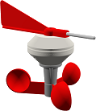
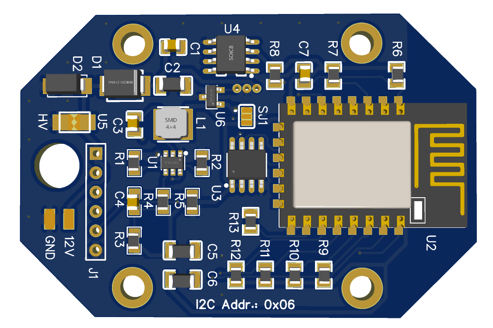
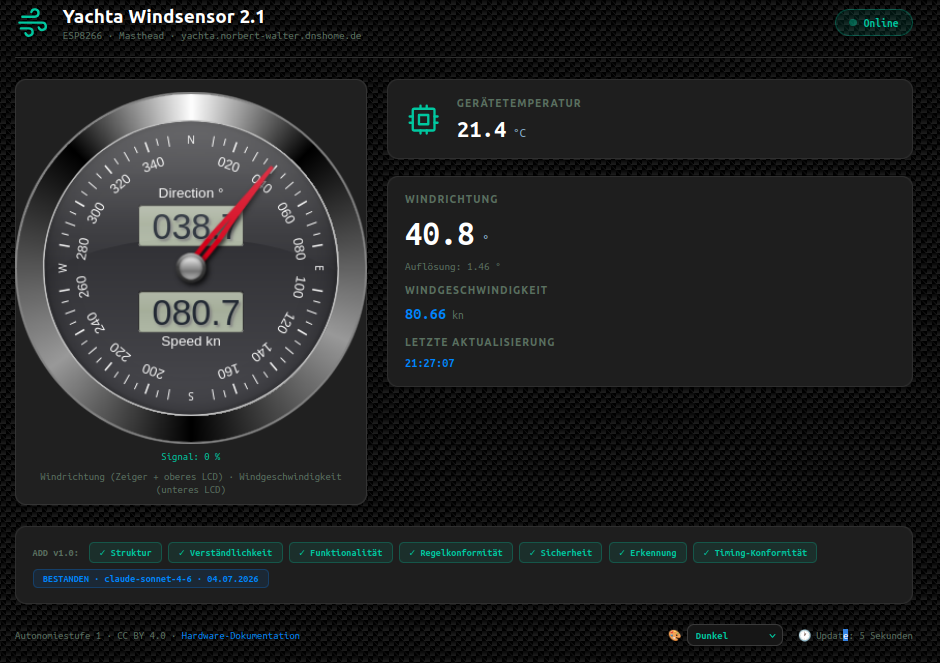

# ADD Test Device Yachta Windsensor (Real Hardware, Simulated Sensor Data)



This document describes a **real test device for AI Device Description (ADD)**. It is a [Yachta Windsensor](https://github.com/norbert-walter/Windsensor_Yachta) for sailboats, a classic IoT device. The electronics run on a genuine ESP8266 on the original Yachta PCB.



The returned sensor readings (wind direction, wind speed, etc.) are **simulated** for this test setup, however. This makes the device ideal for testing AI agents and dashboards against an ADD-compatible device without depending on real sailing weather.

This test device is permanently **publicly accessible on the internet** and is thus **freely available to anyone** who wants to try out ADD functionality for themselves. It is reachable at `https://yachta.norbert-walter.dnshome.de/add`. No device of your own, no access credentials, and no registration are required. Any AI agent can fetch the ADD device description directly and experiment with it.

**What does this example actually demonstrate?** The Yachta Windsensor already ships with its own, hard-coded web frontend (see below). But the real point of this test setup is something else. An AI that knows *nothing* about this specific device beyond its ADD description reads it independently, understands the measurements and actions, and plans a suitable dashboard from that. It then **builds an entirely new, standalone web dashboard** that has nothing to do with the built-in frontend. The device itself required neither modification nor reflashing. This exact full cycle

> **Task definition → Read ADD → Understand the device → Plan the task → Implement the task**

can be demonstrated end-to-end with this test device. The result is a visible, working outcome that makes the value of ADD immediately tangible.

## What Is the Yachta Windsensor?

The Yachta Windsensor is an open-hardware wind sensor for sailboats, whose complete build plans have been published by Open Boat Projects and are continuously developed further by the community. All technical documentation, PCB files, and firmware variants are openly available in the repository.

👉 **https://github.com/norbert-walter/Windsensor_Yachta**

In short, the sensor can:

- measure wind speed and wind direction
- operate robustly and weatherproof (UV-stable, no special metal parts)
- transmit data purely digitally over WiFi; no signal cabling to the mast is required
- run on an ESP8266 as either an access point or a WiFi client
- output NMEA 0183 sentences (including `$WIMWV`, `$WIVWR`, `$WIVPW`) over TCP
- additionally provide the current measurements as JSON (`http://<device-ip>/json`)
- be configured via a built-in web interface; no additional app is needed, a browser is enough
- be flashed directly from the Chrome/Edge browser via a web flash tool

This **built-in web frontend** already displays wind direction, wind speed, and configuration in a hard-coded way. For this ADD test scenario, that's exactly the starting point. Instead of using this fixed frontend, an AI agent reads only the ADD device description and generates from it its **own, freely designable dashboard**. It does so with no prior knowledge of the device and without touching a single line of firmware.

For this ADD test device, the hardware is identical to a regular Yachta Windsensor. Only the source of the measurement values has been replaced with a simulator, so that behavior can be tested reproducibly (e.g. defined wind shifts, gusts, or lulls) without having to actually mount the device outdoors.

## Workflow From the ADD Document to the Dashboard

Like any ADD-compatible device, this wind sensor provides its **ADD device description (JSON)** directly via its web interface.

👉 **https://yachta.norbert-walter.dnshome.de/add**

Besides `device`, `security`, `interfaces`, `actions`, `rules`, and `validation`, the ADD document also contains a `ui` block that points to the matching ADD Dashboard Style Guide.

```json
"ui": {
  "style_guide_url": "https://norbert-walter.github.io/ai-device-description-add/ADD_Style_Guide_v1_0",
  "style_guide_version": "1.0",
  "theme_default": "dark"
}
```

This means the complete cycle can be derived **from that single ADD URL alone**. An agent no longer needs to be given the style guide separately; it finds it right there in the device document. That is precisely the point of a self-describing device. An AI agent goes through the full cycle

> **Task definition → Read ADD → Understand the device → Plan the task → Implement the task**

as follows:

1. **Read ADD**. Fetch the ADD document at `https://yachta.norbert-walter.dnshome.de/add`.
2. **Understand the rules**. Load the Ethical Framework referenced in the `autonomy.ethic_url` field and apply it according to `autonomy.level`. This is mandatory per the `rules` in the document, *before* any action is executed.
3. **Understand the device**. Derive from `interfaces` and `actions` which measurements are available (`read_state`) and which settings can be safely changed (`set_offset`, `set_average`, `set_speed_unit`).
4. **Plan the task**. Load the style guide referenced in the `ui` block and derive a suitable dashboard layout from it (which measurements as an instrument, which as a data panel, etc.).
5. **Implement the task**. Map the measurements (from `GET /json`) and `actions` to components (instrument, data panel, control, …) according to the style guide, and generate a new, standalone dashboard from them. Write actions additionally require HTTP Basic Authentication and, per the `rules`, explicit user confirmation.

The complete ADD specification and the style guide are located in the associated standard repository.

👉 **https://github.com/norbert-walter/ai-device-description-add**

## Example Prompt to Have the AI Carry Out the Complete Cycle

The following prompt shows the minimal task definition needed for an AI to independently work through the complete cycle and build a new dashboard from it. Thanks to the `ui` block in the ADD document, the device's ADD URL alone is enough.

```
I'd like to test the Yachta Windsensor. You can find details on the hardware here:
https://github.com/norbert-walter/Windsensor_Yachta

1. Fetch the ADD device description of the test device.
   https://yachta.norbert-walter.dnshome.de/add
2. Load the Ethical Framework referenced in the `autonomy.ethic_url`
   field and apply it according to `autonomy.level`.
3. Load the ADD Dashboard Style Guide via the URL in the
   `ui.style_guide_url` field of the ADD document.
4. Briefly summarize which interfaces and actions the device offers
   according to the ADD document, and plan a sensible dashboard layout
   from that.
5. Read the current (simulated) sensor data via the `read_state`
   action (GET /json, with a unix timestamp as a cache-buster).
6. Implement the planned design. Generate a standalone HTML dashboard
   according to the style guide:
   - wind direction and wind speed as a dual-pointer instrument
     (Section 6.1 of the style guide)
   - device temperature as a data panel (Section 6.5)
   - a validation strip (Section 6.10) with the result from the
     ADD document's `validation` block
   - theme according to `ui.theme_default`
7. Refresh the display every 5 seconds with new values from the device.
8. Output the dashboard as a file named `yachta_dashboard.html`.

Important. Don't recreate a copy of the existing web frontend.
Build an entirely new, freshly designed dashboard instead.
```

## What Happens When You Use the Prompt?

When an agent (e.g. Claude) works through the prompt above, it reads the ADD document, the Ethical Framework, and the style guide in sequence. It then calls `GET /json?t=<timestamp>` on the device and generates from that **a single, self-contained HTML file**, i.e. a finished dashboard with embedded CSS and JavaScript, exactly as the style guide prescribes as the workflow in Section 10.4 ("Generate self-contained HTML dashboard file").

**The output is therefore not live chat text**, but an HTML file, typically with a name like `yachta_dashboard.html`. It contains

- the SteelSeries instrument for wind direction and wind speed,
- data panels (e.g. device temperature),
- the validation strip with the result from the `validation` block,
- plus a small JavaScript timer that calls `GET /json` on `https://yachta.norbert-walter.dnshome.de` again every 5 seconds and updates the display.

Depending on the environment, the agent either delivers this file as an artifact/download (e.g. in Claude.ai as a file to download) or outputs the complete HTML source directly in the chat.

### To Then Display the Dashboard

1. **Save the file**. Save the HTML file provided by the agent locally (or copy the output source code into a file with the `.html` extension, e.g. `yachta_dashboard.html`).
2. **Open it in a browser**. Open the file by double-clicking it or via "Open File" in Chrome, Edge, or Firefox. A local server isn't needed for this, as long as the device is reachable over the internet or local network (`https://yachta.norbert-walter.dnshome.de`).
3. **Ensure network access**. The computer on which the dashboard is opened must be able to reach the device address. That means internet access, or, for a purely local test address, the same network as the test device.
4. **Watch out for CORS**. Since the dashboard runs as a local file (`file://`) and sends requests to an external domain, depending on browser security settings you may run into CORS restrictions. If that happens, it helps to serve the file via a simple local web server instead (e.g. `python3 -m http.server` in the file's folder and then open `http://localhost:8000/yachta_dashboard.html`), or to upload the file directly to your own web space/GitHub Pages.
5. **Live test**. Once the dashboard loads, a new measurement should appear from the device every 5 seconds. The validation strip shows the most recently known ADD validation status from the `validation` block.


Pic: Dashboard created with Claude Sonnet4

### An Invitation to Experiment

The test becomes most insightful when you enter the same prompt **several times in a row** and compare the results. The generated dashboards will **never be identical**. Layout, wording, color nuances, or the choice of individual style guide components vary slightly each time. That's not a bug. It's inherent to an AI agent that plans and implements anew from the same description every time.

This exact variation invites a deeper understanding of ADD. You can see directly which parts of the dashboard are fixed by the ADD device description and the style guide, and which leave the agent room for creative choices. Anyone who wants to experiment can deliberately vary the prompt (e.g. requesting different components, specifying a different theme, or highlighting additional measurements) and observe how the result changes.

Once a dashboard has been created, you don't have to start from scratch to change it. You can continue making adjustments directly in dialogue with the AI, for example "increase the font size of the display values", "make the refresh rate adjustable", or "add a temperature history as a chart". The agent then adapts the existing dashboard accordingly.

## Why Simulated Data on Real Hardware?

The purpose of this setup is to test ADD implementations (device description, safety rules, dashboard generation) against a **real, physically existing device**, including real network latency, a real web interface, and real firmware, without depending on actual sailing weather. The simulated values vary slightly and cover the entire typical value range, to test the behavior of AI agents under controlled, reproducible conditions.

## Model Comparison Between Different AI Models

To examine how well different AI models can implement the task described above, the same prompt was given to several models and each result was rated across several categories. The rating scale runs from 1 to 10. A 10 means all requirements in that category were met, relative to the model with the best result in that category.

Rated categories:

- **Dashboard Look**. The visual appearance was assessed. Do the grids have consistent spacing? Are the colors, background, and fonts correct?
- **Layout Accuracy**. How closely the implemented layout matches the specification.
- **Instrument**. Whether the specified instrument from the library was used. If not, how well the instrument used displays the data instead.
- **Theme**. How many of the 4 themes were correctly implemented.
- **Feature Scope**. How rich the features are and whether they were correctly implemented.
- **Functionality**. Whether live data is actually read and displayed correctly.

An overall score was calculated across all categories. Additionally, the number of corrections needed until the dashboard was functional and displayed changing content was recorded. Some models (Gemini, Qwen) only simulated the functionality; no corrections were made for these models. Mistral was able to display neither simulated nor live data.

| Rating 1...10 | Claude Sonnet 5 | ChatGPT 5.6 sol | Gemini 3.6 | Mistral Vibe | Kimi K3 flash | Qwen3.5 4B |
|---|---|---|---|---|---|---|
| Dashboard Look | 9 | 10 | 3 | 1 | 8 | 2 |
| Layout Accuracy | 10 | 8 | 2 | 1 | 9 | 2 |
| Instrument | 10 | 10 | 2 | 1 | 9 | 2 |
| Theme | 4 | 4 | 2 | 0 | 4 | 0 |
| Feature Scope | 8 | 9 | 1 | 1 | 10 | 1 |
| Functionality | 10 | 10 | 1 | 1 | 10 | 1 |
| **Score** | **51** | **51** | **11** | **5** | **50** | **8** |
| Number of Corrections | 1 | 0 | 0 | 0 | 5 | 0 |

### Assessment

**Claude Sonnet 5 and ChatGPT 5.6 sol** are tied at the top with 51 points each. Both implement layout, the specified instrument, and live functionality almost completely. ChatGPT scores marginally higher on the visual look, Claude on layout accuracy; overall, their respective strengths balance out.

**Kimi K3 flash** follows closely with 50 points, and even achieves the best score for feature scope. However, that came at the cost of 5 corrections, noticeably more than any other model. This reflects a common pattern. A richer, more ambitious feature set also increases the risk of implementation bugs before the dashboard is actually functional.

**Gemini 3.6 and Qwen3.5 4B** fall well behind with 11 and 8 points respectively. Both models only simulated the live data connection instead of actually implementing it, which is directly reflected in low scores for feature scope and functionality. They also largely missed the style guide's requirements for the instrument and theme, suggesting these models were not able to reliably implement the style guide's structural requirements.

**Mistral Vibe** comes last with 5 points. The model could display neither simulated nor real live data, leaving it completely ineffective in the most important category, functionality.

The number of corrections offers an additional perspective. It reflects less how well a model performs in the end, and more how directly it got there. Claude needed only one small correction, while ChatGPT and the lower-scoring models needed none (for Gemini and Qwen, however, only because the functionality was merely simulated and therefore never actually corrected). Kimi K3 shows that a rich feature set doesn't automatically come with few corrections; here it was explicitly paid for with iterative debugging.

As the underlying methodology, the test was run only once per AI model, to determine the result to be expected. With multiple runs, the overall result could shift slightly in favor of other, similarly capable AI models. Overall, the 3 strongest models are very close together.

### Conclusion

Which model is best suited? For this kind of task, i.e. independently reading an ADD device description, understanding a style guide, and directly implementing it as a working dashboard that operates on live device data, **Claude Sonnet 5 and ChatGPT 5.6 sol** are clearly in the lead. Both achieve the highest overall score and implement both the specified instrument and the live data connection nearly flawlessly.

Between the two, in practice I'd lean toward **Claude Sonnet 5**. It achieves the best score for layout accuracy, needed only one small correction, and delivers the most balanced result across all categories. ChatGPT is an equally strong alternative for this task and scores marginally higher on pure visual appearance.

Anyone who values a particularly rich feature set and is willing to plan for more correction cycles could also consider **Kimi K3 flash**. It trails the top models only narrowly but required significantly more rework before the dashboard was actually functional. For production use without much follow-up correction, Gemini 3.6, Qwen3.5 4B, and especially Mistral Vibe are not currently recommended based on this test, since they don't reliably meet the core requirement, correctly reading and displaying live data according to ADD.

It's worth noting that Qwen3.5-4B was included somewhat outside the regular field. It's a very small AI model, and its main appeal is that it can run on consumer hardware such as an ordinary PC rather than requiring cloud infrastructure. Given that, it's a notable result that it performed clearly better than Mistral Vibe.
