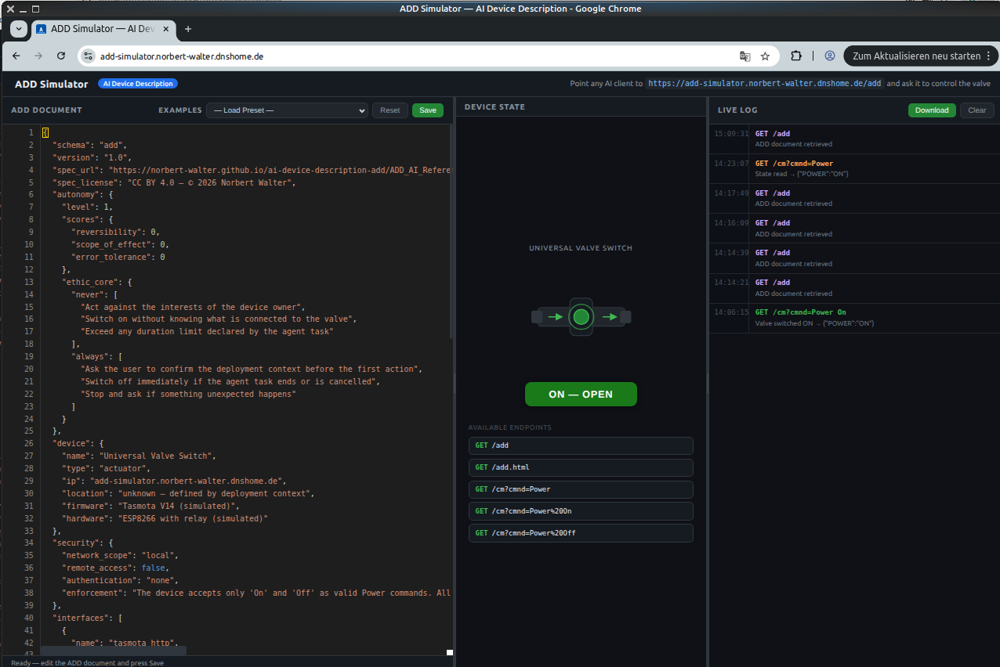

# ADD Simulator

Interactive simulator for the **AI Device Description (ADD)** open standard.



Simulates a Tasmota-style valve device with a live web UI — no tools or APIs
to install. Point any AI client with web access at `/add` and start exploring.

---

## Quickstart — Docker

There are two ways to run the simulator as a Docker container: build it
yourself from the source code, or pull the ready-to-use image from Docker Hub.

**Option 1 — Build from source:**

```bash
docker compose up --build
```

**Option 2 — Pull from Docker Hub:**

A pre-built image is available at:

```
https://hub.docker.com/r/openboatprojects/add-simulator
```

Pull and start it with:

```bash
docker pull openboatprojects/add-simulator
docker compose up
```

Open http://localhost:5000 in your browser.

## Quickstart — Local (Python)

```bash
pip install flask
python app.py
```

Open http://localhost:5000 in your browser.

## Hosted Demo

A public instance is available at:

```
https://add-simulator.norbert-walter.dnshome.de/
```

No installation required — use it directly with any AI client.

> **Shared instance notice:** This is a single shared simulator instance used
> by all visitors simultaneously. The valve state is global — any user or AI
> client can change it at any time. The web UI can be opened on multiple
> clients at the same time and updates in real time, but only one client
> should actively control the valve at a time to avoid conflicting commands.
> Coordinate with other users before running automated test sequences.
>
> **For serious testing:** The hosted instance is a simplified simulation
> intended to demonstrate the ADD concept. For reliable and reproducible
> tests, run a local instance of the simulator instead (see Quickstart above).

---

## How to use with an AI client

Start the simulator locally or use the hosted demo, then choose one of the
two variants below depending on your AI client setup.

### Web UI

Open the simulator URL in your browser to monitor and interact with the device:

| Area | Function |
|------|----------|
| **ADD Document** (left) | Edit the live ADD JSON, save changes, reset to default |
| **Device State** (middle) | Visual valve state — updates in real time |
| **Live Log** (right) | Every endpoint call with timestamp and response |

### Device endpoints

The AI client controls the simulated valve via these endpoints:

| Endpoint | Description |
|----------|-------------|
| `GET /add` | ADD device description (JSON) — the AI reads this first |
| `GET /add.html` | ADD document rendered as HTML |
| `GET /cm?cmnd=Power` | Read current valve state |
| `GET /cm?cmnd=Power%20On` | Open valve |
| `GET /cm?cmnd=Power%20Off` | Close valve |

The AI client reads `/add` to understand the device capabilities and rules,
then uses the `/cm` endpoints to control the valve. Every call appears in
the Live Log with timestamp and response.

### How an AI accesses the device

An AI client interacts with the simulator exclusively via HTTP GET requests —
the same mechanism a browser uses to load a web page. The AI first fetches
the ADD document at `/add` to read the device description, capabilities, and
rules. It then sends control commands to the `/cm` endpoints to operate the
valve.

To make these HTTP requests, the AI needs a **fetch mechanism**. There are
two ways to provide this:

- **Built-in web access** — most AI clients include a native web fetch
  capability that allows them to retrieve URLs during a conversation. No
  additional setup is required, but responses may be cached within a session.
  In addition, many AI clients apply strict internal security policies to
  their built-in web access, which can limit or block requests to certain
  URLs, local addresses, or non-standard endpoints.
- **MCP fetch tool** — an external MCP service provides a `fetch` tool that
  the AI can call explicitly. This bypasses client-side caching entirely and
  gives the AI direct, reliable access to the simulator at any time. MCP
  tools are not subject to the same security restrictions as built-in web
  access, making them significantly more flexible for hardware interaction.

Both approaches are described below.

---

### Variant A — Native web access (no MCP, no Pro subscription required)

Most AI clients (Claude, ChatGPT, Perplexity, …) support built-in web access
that can fetch URLs directly. This variant works without any additional setup.

**Known limitation:** Some AI clients cache HTTP responses within a session.
If the simulator was temporarily unreachable when you first started the
conversation, the client may return a cached error on subsequent requests.
**Start a fresh conversation** to clear the session cache.

As an additional safeguard, append a Unix timestamp to every URL to prevent
caching:

```
https://add-simulator.norbert-walter.dnshome.de/add?t=<unix-timestamp>
```

**Prompt to use:**

```
Read the ADD device description at
https://add-simulator.norbert-walter.dnshome.de/add?t=<unix-timestamp>
and help me control the valve.
For every subsequent request append a current Unix timestamp as query
parameter ?t=<unix-timestamp> to avoid cached responses.
```

Replace `<unix-timestamp>` with the current Unix time (e.g. `1751500000`).
You can get the current value at https://www.unixtimestamp.com/.

---

### Variant B — MCP-based access (recommended, requires Pro subscription)

Using MCP services bypasses all client-side caching and gives the AI
direct, reliable HTTP access to the simulator. This is the recommended approach
for serious testing and ADD validation.

**Requirements:**
- Claude Pro or ChatGPT Plus/Team/Enterprise subscription
- MCP services connected to the AI client

Public MCP services are available at:

| Service | Description |
|---------|-------------|
| `mcp-fetch.norbert-walter.dnshome.de` | Fetch a URL and return its content |
| `mcp-time.norbert-walter.dnshome.de` | Query and convert times |
| `mcp-duckduckgo.norbert-walter.dnshome.de` | Web search via DuckDuckGo |
| `mcp-file-edit.norbert-walter.dnshome.de` | File operations and Git integration |

All four MCP services should be installed for full ADD functionality.

---

#### Setting up MCP services in Claude (Desktop and Web Client)

Claude supports MCP servers with Streamable HTTP. Add each server individually via Settings:

→ **User → Settings → Customize Connectors → + (Add custom connector) → Enter name → Enter URL → Add**

```
Name: mcp-fetch
URL:  https://mcp-fetch.norbert-walter.dnshome.de/mcp

Name: mcp-time
URL:  https://mcp-time.norbert-walter.dnshome.de/mcp

Name: mcp-duckduckgo
URL:  https://mcp-duckduckgo.norbert-walter.dnshome.de/mcp

Name: mcp-file-edit
URL:  https://mcp-file-edit.norbert-walter.dnshome.de/mcp
```

After saving, the tools will appear under Connectors and are available
in every new conversation.

---

#### Setting up MCP services in ChatGPT

ChatGPT supports MCP servers via Custom Connectors using SSE (Plus/Team/Enterprise).
Developer Mode must be enabled first:

→ **User → Settings → Apps → Advanced Settings → Developer Mode → Enable**

Then add each connector individually:

→ **User → Settings → Apps → Create App**

```
Name:           mcp-fetch
Description:    Fetch a URL and return its content as Markdown
Connection:     HTTP connection
Authentication: No authentication
Enable checkbox (security notice)
URL: https://mcp-fetch.norbert-walter.dnshome.de/sse

Name:           mcp-time
Description:    Query and convert times
Connection:     HTTP connection
Authentication: No authentication
Enable checkbox (security notice)
URL: https://mcp-time.norbert-walter.dnshome.de/sse

Name:           mcp-duckduckgo
Description:    Web search via DuckDuckGo
Connection:     HTTP connection
Authentication: No authentication
Enable checkbox (security notice)
URL: https://mcp-duckduckgo.norbert-walter.dnshome.de/sse

Name:           mcp-file-edit
Description:    File operations and Git integration
Connection:     HTTP connection
Authentication: No authentication
Enable checkbox (security notice)
URL: https://mcp-file-edit.norbert-walter.dnshome.de/sse
```

Each MCP service must be added as a separate Custom Connector.

---

#### Prompt to use with MCP:

```
Use the fetch tool to read the ADD device description at
https://add-simulator.norbert-walter.dnshome.de/add
and help me control the valve.
Use the fetch tool for all subsequent requests to the simulator.
Do not use your built-in web access for this session.
```

> **Important:** The explicit instruction to use the `fetch` tool is required.
> Without it, some AI clients fall back to their native web access, which may
> return cached responses.

---

## ADD Specification

https://norbert-walter.github.io/ai-device-description-add/

© 2026 Norbert Walter — CC BY 4.0
